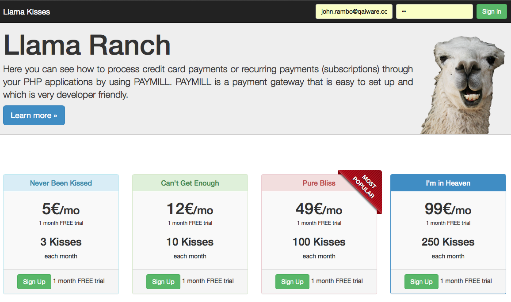
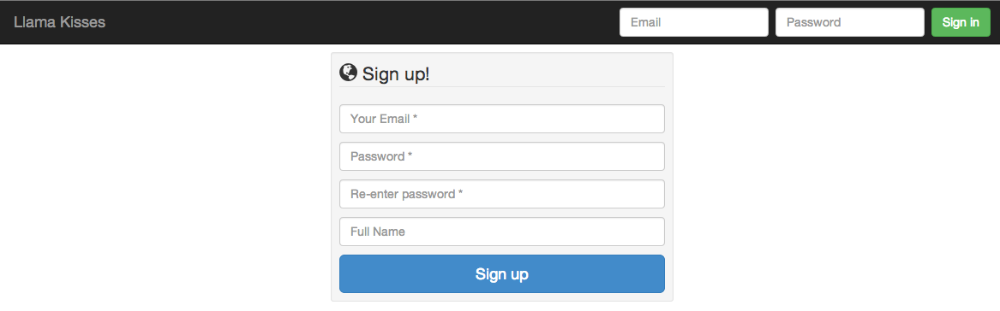
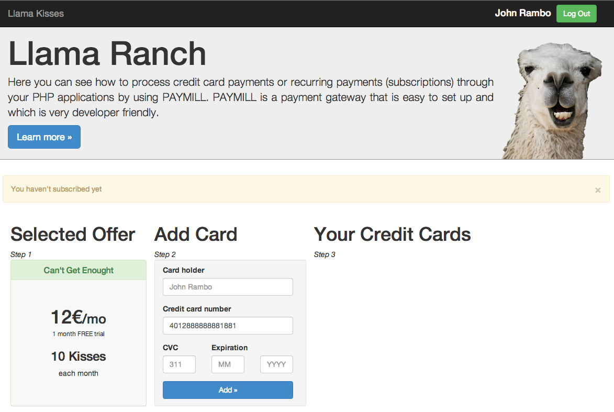
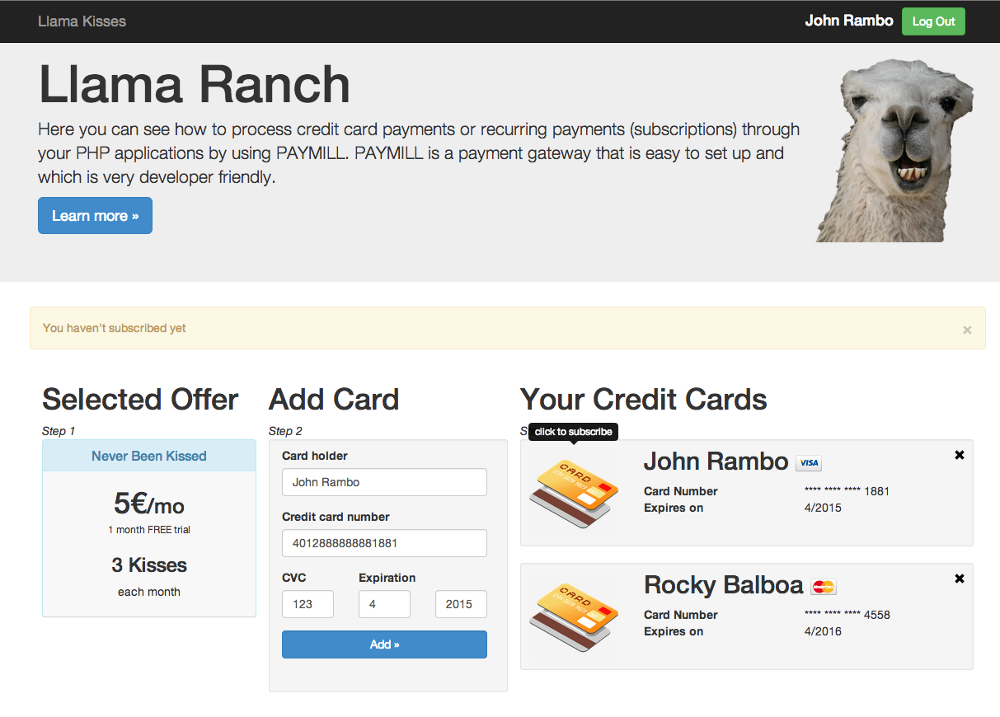
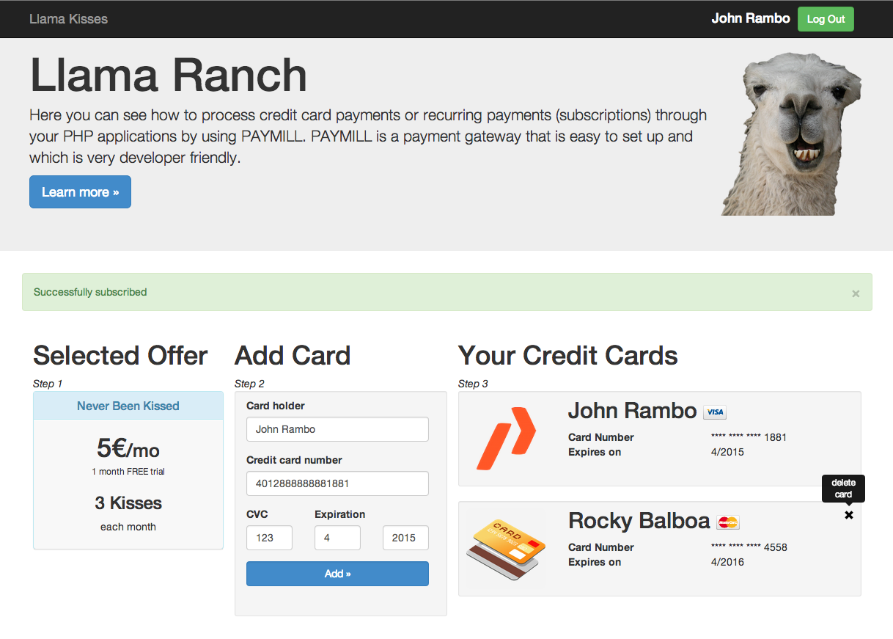
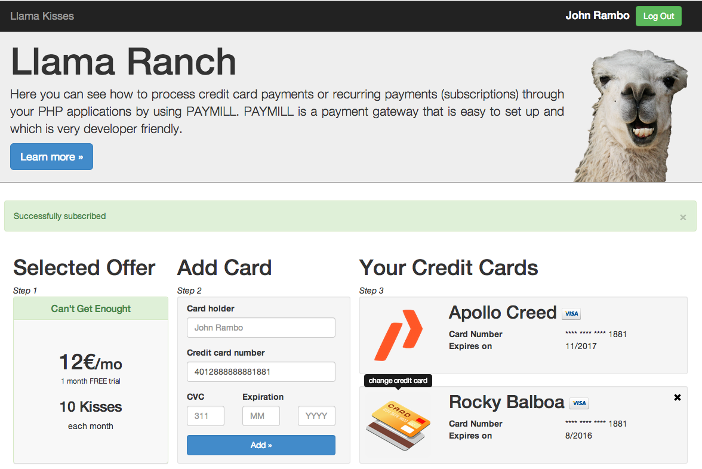
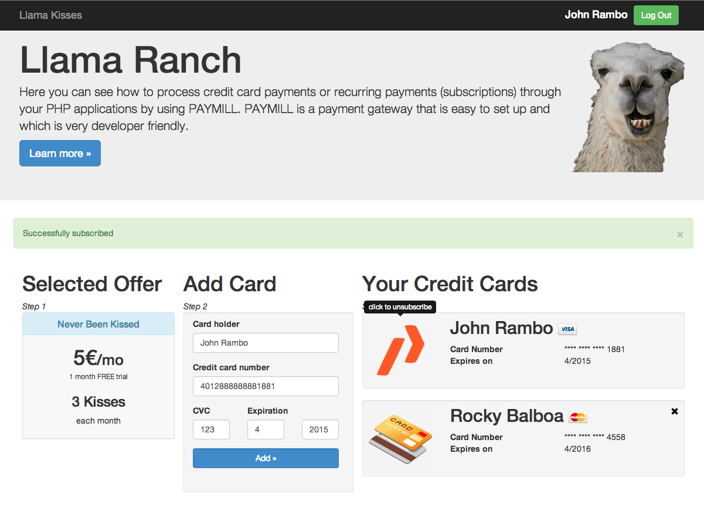

# Recurrent Billing with PAYMILL

PAYMILL is a full-stack payment solution with very reasonable pricing and is easy to setup. See how to add it to a PHP application here.

If you ever need to process credit card payments or recurring payments aka. subscriptions through your PHP applications, you should take a look at PAYMILL. PAYMILL is a payment gateway that is easy to set up and which is very developer friendly. It only charges fees on a per-transaction basis and these are very reasonable. There are no monthly fees or other hidden costs.

### What does the application

In this tutorial we’ll use PAYMILL to add recurring payments to a PHP application. The application, which we’ll use is a site that sells Llama Kisses ;) The customer can subscribe to а plan and each month he will be charged by PAYMILL to get his llama kisses.



There are four different plans and users can sign up for any one of them to create a subscription. When the user clicks on one of the **Sign Up** buttons, he will be redirected to the sign up page.



After the user register himself, he will be asked to provide one or more credit cards.



Now, when the user has at least one credit card, he can select one of them by pressing the credit card icon



Or remove existing credit card, if this credit card is not currently used by the subscription.



Of course the user can update his subscription by changing his credit card. This is an important case and this action will be required when the user has insufficient funds on his card or the credit card has expired.



Last but not least the user can unsubscribe. At this point it is important to mention that he should be able to use paid service until the end of the period.



### Application internals

**Dependencies management**

Lets start at the beginning. As every application developer you don't want to write everything on your own. Nowadays for each programming language there are a lot of tools and frameworks, which we can use to speed up the development process and make our lives easier.

For dependencies management *Llama Kisses* Project uses the standard tool for PHP developers, namely **composer**. Dependencies are described in a JSON format and should exist in the root folder of your project in file called **composer.json**. In this example we will use four dependencies:
* [monolog](https://github.com/Seldaek/monolog) - logging library
* [twig](http://twig.sensiolabs.org/) - template engine for PHP
* [bootstrap](https://github.com/twbs/bootstrap) - CSS & JavaScript framework for faster and easier web development
* [paymill](https://github.com/paymill/paymill-php) - PHP library, which simplifies development against PAYMILL API and hides communication infrastructure.

Our source files are located under **src** folder. Now, with this in mind, you should easily understand the format of the composer.json file.

```json
{
    "name": "paymill/llama-kisses",
    "version": "1.0.0",
    "autoload": {
        "psr-0": {
          "LlamaKisses": "src/Paymill"
        }
    },
    "require": {
        "monolog/monolog": "1.7.*",
        "paymill/paymill": "3.0.*",
        "twbs/bootstrap": "3.0.*",
        "twig/twig": "1.15.*"
    }
}
```

As you can see there is also some meta information, which can be stored in composer.json like name and version.

When you run in your terminal **composer install** (I assume that you have already downloaded the composer), in your project root you should see new file: **composer.lock** and new **vendor folder**. In composer.lock you can see detailed description of each dependency. In vendor folder you can find each requested library together with its dependencies if some.

**Application routing**

The application implements custom MVC like dispatcher. Every request goes to **index.php**. The script in this file loads all libraries, instantiate the view rendering engine and based on the GET parameters: *controller* and *action* creates new instance of the controller and calls its requested method.

**Database**

In application's database we store 3 tables:
* offers: Contains columns name, amount and PAYMILL Offer identifier
* users: Contains columns email, password, name, offer_id and PAYMILL Client identifier
* subscriptions: Contains columns active, next_capture_at, canceled_at, user_id, PAYMILL Payment identifier and PAYMILL Subscription identifier.

If you run the application locally you don't need to prepare the database. Take a look in scripts folder. There you can find a file called seeds.php. This file creates the schema, its tables and seeds the database with initial data, namely the offers. The offers we use are linked via offerId to a test PAYMILL account. To make this script work you need to provide the credentials for your MySQL server.

```php
$link = mysqli_connect( "127.0.0.1", "MYSQL_USERNAME", "MYSQL_PASSWORD" );
```

**Models**

For dealing with the database and the external data from PAYMILL we have four models, each of them extends the Base model, which holds a connection to the database and connection to PAYMILL:
* Card: contains information from PAYMILL server. Card model does not store data on our local database.
* Offer: contains information from local database. Offer model does not communicate with PAYMILL API.
* Subscription: contains information from local database and PAYMILL server.
* User: contains information from local database and PAYMILL server.

Card model communicates only with PAYMILL server. This model does not store data in the local database. This model is responsible for creating, verifying and deleting customer's credit cards from PAYMILL server. Here we have to note on the verification process. Because the token generated by [PAYMILL's Bridge](https://www.paymill.com/en-gb/documentation-3/reference/paymill-bridge/) is valid only 5 minutes and can be used only once, we need to create a [PAYMILL Payment](https://www.paymill.com/en-gb/documentation-3/reference/api-reference/#document-payments) object. This object can be used multiple times. And because our business model ( selling llama kisses ) has a trial period we won't charge the customer within 5 minutes, but after 1 month. In order to activate this payment object for future transactions, we need to create a [PAYMILL Preauthorization](https://www.paymill.com/en-gb/documentation-3/reference/api-reference/#document-preauthorizations) and delete it immediately.

```php
public function verify( $amount, $currency ) {
  $preAuth = new Preauthorization();
  $preAuth->setPayment( $this->paymillId )
          ->setAmount( $amount )
          ->setCurrency( $currency );

  $response = $this->request->create( $preAuth );

  $preAuth = new Preauthorization();
  $preAuth->setId( $response->getId() );
  $this->request->delete( $preAuth );
}
```
For the complete flow, take a look in our [FAQs](https://support.paymill.com/hc/en-us/articles/200261507-How-can-I-store-credit-card-data-without-charging-a-transaction-right-away)

Offer model search in the local database. Since we replicate the required information from PAYMILL, we do not need external calls.

User model deals with the local database and with PAYMILL API. The model is responsible for register, logging in the user and to search him by id (for retrieving the user from the session). This model also contains a list of customer's credit cards and the active subscription.

Subscription model is heart of the application. Basically this model is responsible to create, update and delete a subscription, but since there are many states in which a subscription can be, we will discuss its fields and its combinations with more details. Let's start one by one:
* active: **true** if the subscription has successfully charged the customer, **false** if the transaction has failed.
* next_capture_at: Timestamp in seconds that indicates when the next charge will be done.
* canceled_at: **null** when user is subscribed, timestamp in seconds if the user has unsubscribed.
* paymill_id: The id of the subscription in PAYMILL
* payment_id: The PAYMILL Payment Id, from which the customer will be charged.
* user_id: Reference to the user in the local database.

Let's explain the following scenarios, where user is subscribed:
* The user has cancelled his subscription: In our local database we have active is true and canceled_at is not null. This means to us that the user will not continue the subscription, but we heed to let him use his service until the end of paid period.
* The user has a subscription but the transaction has failed: In that case the active flag is set to false, the user will be notified and he has to take an action. Llama Kisses is tolerant in this case and let the user use the service until the next capture date. If the user changes his credit card, he will be automatically charged, but if the reason was insufficient funds and he took an action outside of the system, llama-kisses won't get that. We suggest to handle this case by creating some cron jobs.
* The user has a subscription but second transaction fails: Obviously the user doesn't want to use our service any more. He was notified about the failed transaction, but he didn't take any action. After our tolerance period in the local database we have active as false and canceled_at as timestamp in seconds.
* The system has cancelled the customer's subscription and he want to subscribe again: In that case we create a new subscription to the same offer and charge the client immediately. The reason for that is that we know that he was subscribed and his previous subscription is no longer active.

As conclusion we can say that if canceled_at is not null the offer is not active. If the active is false there ware a problem with charging subscriber's credit card, but our system tolerates him and we let him use the service until he takes an action or until the next capture date. If canceled_at is not null and active is true we let the subscriber use his service until next capture date.

**Controllers**

The controllers are responsible to take the parameters from the URL or from a HTML form and to pass them to the corresponding model. They are very skinny and except the UserController, which in addition sets and clears the user's session, the get the input parameters calls the corresponding model and return this model to its view. The view follows the same name convention as the controller and its action. For example if we call index() method on PagesController the view can be found in ./src/Paymill/LlamaKisses/Views/pages/index.html

WebhooksController is different from other controllers and is responsible for handling the asynchronous calls from PAYMILL. We will discuss this controller in а separate paragraph.

### Adding PAYMILL to a PHP Application

Getting started with PAYMILL is easy. Visit [paymill.com](http://paymill.com) and click on sign up button. Once we’ve done that we can visit the page for our account, where we’ll see, amongst other things, the API keys we’ll need to communicate with PAYMILL’s REST API. PAYMILL needs two API keys so that it knows which account it’s working with. We’ll store the public key and application mode in assets/js/paymill.js

```javascript
var PAYMILL_PUBLIC_KEY = 'YOUR_PUBLIC_API_KEY';
var PAYMILL_TEST_MODE  = true;
```
The private key will be stored in src/Paymill/LlamaKisses/Models/Base.php directly in the constructor of Paymill\Request class.

```php
namespace LlamaKisses\Models;

use Paymill\Request;

abstract class Base {

  protected $db;
  protected $request;

  public function __construct() {
    $this->db = mysqli_connect( "127.0.0.1", "root", "root" );
    mysqli_select_db( $this->db, 'llama-kisses' );
    $this->request = new Request( "YOUR_PRIVATE_API_KEY" );
  }

}
```

**Dealing with clients**

Once the user register to llama-kisses app, we will store his email, name, password and selected offer to our local database. This behaviour is very typical for every web application. But in this case we also want to create a PAYMILL Client, so that we can associate and store the user's credit card data on PAYMILL's server. This is done via user's create method. First we create a PAYMILL Client and then store the user into the local database with PAYMILL's reference to it.

```php
public function create() {
  $client = new \Paymill\Models\Request\Client();
  $client->setEmail( $this->email );
  $id = $this->request->create( $client )->getId();
  $this->log->addInfo( $id );

  mysqli_query( $this->db, "INSERT INTO `users`( `email`, `password`, `name`, `paymill_id`, `offer_id` ) VALUES( '$this->email', '$this->password', '$this->name', '$id', '$this->offerId' )" );
  $this->id = $this->db->insert_id;
  mysqli_close( $this->db );
}
```
Don't forget that we have initialize the PAYMILL request object in the Base class. Each class, which will communicate with PAYMILL, has to extend the Base class. That way $this->request is available.

```php
class User extends Base {
```
PAYMILL may throw an exception, but since this is not the scope of this tutorial, we will leave it to the readers.

**Adding PAYMILL’s JavaScript and The API Key**

When a user submits his credit card information in a form, the credit card information goes directly to PAYMILL’s server and not to our application at all. This makes it a lot easier to get PCI compliance. If we look at the example form on PAYMILL’s page, we’ll see that none of its fields has a name attribute. This means that when the form is submitted these fields aren’t passed to our application’s server. Instead they’ll be submitted via the PAYMILL's JavaScript.

To use PAYMILL in our application we need to include a JavaScript file from PAYMILL’s server. Then we set our publishable key and add some JavaScript that will fire, when the form containing the credit card fields is submitted. This JavaScript will generate a token based on the credit card information from the form.

We’ll add PAYMILL’s JavaScript file in our src/Paymill/LlamaKisses/Views/application/footer.html file. It needs to be placed before the application’s own JavaScript file, right after the div.

```html
<div id="footer">
  <div class="container">
    <p class="text-muted">Copyright © 2013-2014 <a href="http://www.paymill.com" rel="external" style="text-decoration: none;">PAYMILL</a></p>
  </div>
</div>
<script src="https://bridge.paymill.com/" type="text/javascript"></script>
<script src="https://static.paymill.com/assets/js/jquery/jquery-1.7.2.min.js" type="text/javascript"></script>
<script src="assets/js/paymill.js" type="text/javascript"></script>
<script src="assets/js/bootstrap.min.js" type="text/javascript"></script>
```

Next let's explain the credit card fields in the subscription wizard. The form contains a hidden fields that holds the currency and the amount. Other input fields won't be submitted to our server, because they don't have the name attribute.

```html
<form accept-charset="UTF-8" action="index.php?controller=cards&action=create" class="require-validation" id="card-tds-form" method="POST">
  <div class='form-row'>
    <div class='col-xs-12 form-group required'>
      <label class='control-label'>Card holder</label>
      <input class='form-control card-holdername' size='4' type='text' placeholder='John Rambo'>
    </div>
  </div>
  <div class='form-row'>
    <div class='col-xs-12 form-group card required'>
      <label class='control-label'>Credit card number</label>
      <input autocomplete='off' class='form-control card-number' size='20' type='text' value='4012888888881881'>
    </div>
  </div>
  <div class='form-row'>
    <div class='col-xs-4 form-group cvc required'>
      <label class='control-label'>CVC</label>
      <input autocomplete='off' class='form-control card-cvc' placeholder='311' size='4' type='text'>
    </div>
    <div class='col-xs-4 form-group expiration required'>
      <label class='control-label'>Expiration</label>
      <input class='form-control card-expiry-month' placeholder='MM' size='2' type='text'>
    </div>
    <div class='col-xs-4 form-group expiration required'>
      <label class='control-label'> </label>
      <input class='form-control card-expiry-year' placeholder='YYYY' size='4' type='text'>
    </div>
  </div>
  <input class="card-amount" type="hidden" name='amount' size="4" value="200" />
  <input class="card-currency" type="hidden" name='currency' size="4" value="EUR" />
  <div class='form-row'>
    <div class='col-md-12 form-group' style="margin-bottom: 12px;">
      <button class='form-control btn btn-primary submit-button' type='submit'>Add »</button>
    </div>
  </div>
</form>
```
Next let's take a look at the JavaScript that fires, when the form is submitted. This script will submit the credit card information to PAYMILL and submit the token that it receives back from PAYMILL through the form.

```javascript
var PAYMILL_PUBLIC_KEY = 'YOUR_PUBLIC_API_KEY';
var PAYMILL_TEST_MODE  = true;

$(document).ready(function() {
  $( "#card-tds-form" ).submit(function(event) {
    event.preventDefault();
    try {
      paymill.createToken( {
        number:     $('#card-tds-form .card-number').val(),
        exp_month:  $('#card-tds-form .card-expiry-month').val(),
        exp_year:   $('#card-tds-form .card-expiry-year').val(),
        cvc:        $('#card-tds-form .card-cvc').val(),
        cardholder: $('#card-tds-form .card-holdername').val(),
        amount:     $('#card-tds-form .card-amount').val(),
        currency:   $('#card-tds-form .card-currency').val()
      }, PaymillResponseHandler);
    } catch(e) {
      logResponse(e.message);
    }
  });

  function PaymillResponseHandler( error, result ) {
    if( error ) {
      // Shows the error above the form
      $( ".errors.panel.panel-danger").removeClass( "hide" );
      $( ".errors.panel-heading" ).text( error.apierror );
      $( ".submit-button" ).removeAttr( "disabled" );
    } else {
      var form = $( "#card-tds-form" );
      // Output token
      var token = result.token;
      // Insert token into form in order to submit to server
      form.append(
        "<input type='hidden' name='card[token]' value='"+token+"'/>"
      );
      form.get(0).submit();
    }
  }

  function logResponse(res) {
    // create console.log to avoid errors in old IE browsers
    if (!window.console) console = {log:function(){}};
    console.log(res);
  }
```
This code should only run after the page’s DOM has loaded and so it’s all wrapped in the **$(document).ready()** function. The script listens for submit event on form with id **card-tds-form**. When the user submit this form, the script forwards this request not to our server, but to the PAYMILL server by calling the method createToken and collecting its parameters from the form. After createToken() function is done, it will call the callback function PaymillResponseHandler(). If there are some problems with the user input, the error variable will be true and this error will be displayed to the customer. If there is no error, the script appends a hidden input field, which contains the generated token and submits the form to our server.

**Handling the credit cards**

On llama-kisses server we get the encoded representation of the credit card as token. This token is valid for 5 minutes and can be used only one time. For the time being we won't charge the customer, because our offer has trial period of 30 days. This means that the token will be expired, when we want to make the transaction. To deal with it, PAYMILL offers to save the client's credit card as Payment. We create the Payment object in Card's constructor

```php
public function __construct( $params = null ) {
  parent::__construct();
  $this->log = new Logger( 'LLAMA_KISSES::Card' );
  $this->log->pushHandler( new StreamHandler( 'logs/llama_ranch.log', Logger::INFO ) );
  if( $params != null ) {
    $user = User::findById( $_SESSION['current_user'] );
    $this->payment = new Payment();
    $this->payment->setToken( $params['token'] )
                  ->setClient( $user->getPaymillId() );
  }
}
```
We store it in PAYMILL via Card's create method

```php
public function create() {
  $this->paymillId = $this->request->create( $this->payment )->getId();
}
```
And verify if the credit card is valid by Card's verify method

```php
public function verify( $amount, $currency ) {
  $preAuth = new Preauthorization();
  $preAuth->setPayment( $this->paymillId )
          ->setAmount( $amount )
          ->setCurrency( $currency );

  $response = $this->request->create( $preAuth );

  $preAuth = new Preauthorization();
  $preAuth->setId( $response->getId() );
  $this->request->delete( $preAuth );
}
```
Here it's very important to note that the amount and the currency should be the same as these used in the JavaScript call. We need to make the validation in order to activate the payment object, which can be used for future transactions.

**Dealing with subscriptions**

Now comes the interesting part. The customer has an account in our local database. This account is also stored on PAYMILL's server with one or more credit cards. To create a subscription we use again the PAYMILL PHP wrapper. Creating subscription looks like this snippet from Subscription's create method:

```php
$subscription = new \Paymill\Models\Request\Subscription();
$subscription->setId( $subscription_id )
             ->setPayment( $this->payment );
$this->request->update( $subscription );
```
We set PAYMILL's clientId, offerId and paymentId and call the lib to do the work. As you can see in our previous steps, we create a clientId by user's registration. We create a paymentId when the user enters his credit card details and we have the offerId by seeding the database. With this information we create our subscription. If the subscription has no trial period, a transaction will be created immediately after the user subscribes. With trial period PAYMILL will wait until the next capture date to trigger the transaction.

Updating a transaction make sense when the user has expired credit card and he wants to provide a new one. The update is executed in Subscription's update method

```php
public function update( $subscription_id ) {
  $subscription = new \Paymill\Models\Request\Subscription();
  $subscription->setId( $subscription_id )
               ->setPayment( $this->payment );
  $this->request->update( $subscription );

  mysqli_query( $this->db, "UPDATE subscriptions s SET payment_id = '$this->payment' WHERE s.paymill_id LIKE '$subscription_id'" );
  mysqli_close( $this->db );
}
```
At this point it is very important to note that if you update the offer, this will result in new subscription. It is better to delete the subscription and to create a new one instead to update the old one.

### Webhooks or asynchronous calls from PAYMILL

With webhooks PAYMILL gives you the possibility to react automatically to certain events which happen within their system. A webhook is basically a URL where PAYMILL sends an HTTP POST request to, every time one of the events attached to that webhook is triggered. You can manage your webhooks via the API or you can use the web interface inside the PAYMILL merchant's center.

There are a number of events you can react to. Each webhook can be configured to catch any kind of event individually, so you can create different webhooks for different events. In our application we are subscribed to all kind of events within one webhook and react depending on webhook's type in a single method. You can see all available events [here](https://www.paymill.com/en-gb/documentation-3/reference/api-reference/#events).

Llama Kisses application reacts on three events:
* subscription.succeeded: Here we just update the subscription within our database by actualizing the next_capture_date.
* subscription.updated: In this case the user has changed his credit card. He is in our tolerance period, so we create a transaction immediately to charge him for the current period.
* transaction.failed: This event is received when PAYMILL tries to charge the subscriber, but something is wrong with his credit card (e.g. insufficient funds, card is blacklisted, card is expired and so on). Please take a look to the [possible reasons](https://www.paymill.com/en-gb/documentation-3/reference/api-reference/#document-statuscodes) for rejecting a transaction. Here we will set the subscription property active in our database to false.

All other events will be just logged, but no action will be taken.
