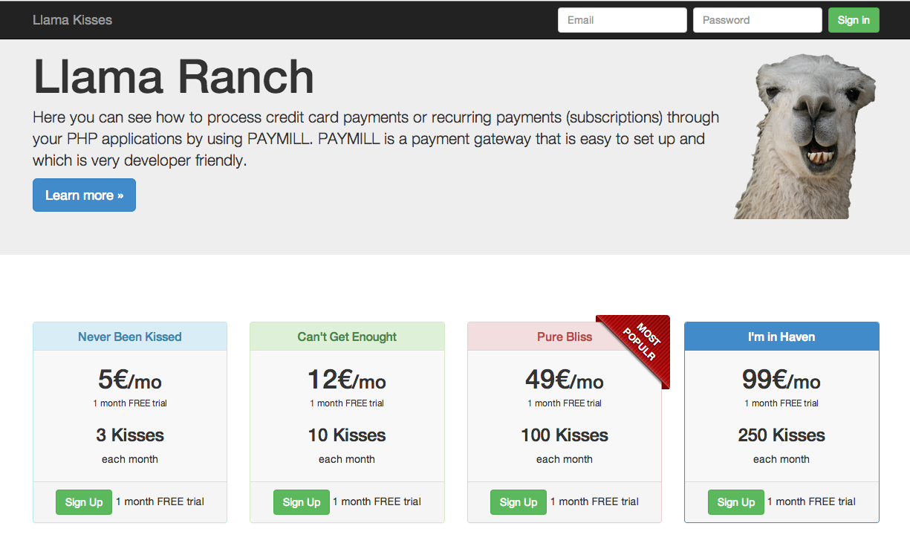

# Recurent Billing with PAYMILL

PAYMILL is a full-stack payment solution with very reasonable pricing and is easy to setup. See how to add it to a PHP application here.

If you ever need to process credit card payments or recurring payments aka. subscriptions through your PHP applications you should take a look at PAYMILL. PAYMILL is a payment gateway that is easy to set up and which is very developer friendly. It only charges fees on a per-transaction basis and these are very reasonable. There are no monthly fees or other hidden costs.

### Adding PAYMILL to a PHP Application

In this tutorial we’ll use PAYMILL to add recurring payments to a PHP application. The application we’ll use is a site that sells Llama Kisses. ;)

